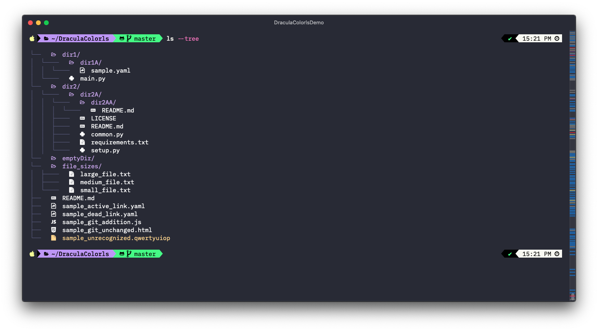
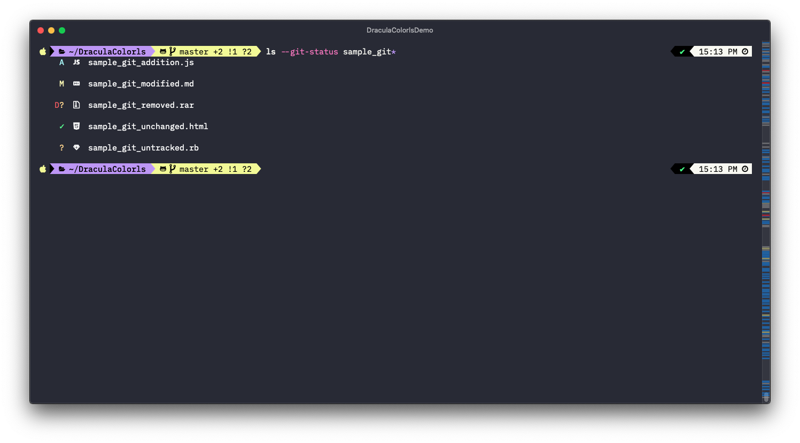

# Dracula for [colorls](https://github.com/athityakumar/colorls)

> A dark theme for [colorls](https://github.com/athityakumar/colorls).

(note: `ls` has been aliased to `colorls --sd --dark` above)

## Install

All instructions can be found at [draculatheme.com/colorls](https://draculatheme.com/colorls).

---

## Samples

Some examples of a select set of `colorls` options not(see the colorls repo for full optional flags).

### Tree

### Git Status (addition, modified, deleted, unchanged, untracked)

## Team

This theme is maintained by the following person(s) and a bunch of [awesome contributors](https://github.com/dracula/template/graphs/contributors).

|  |
| ------------------------------------------------------------------------------------------------------------ |
| [George Pickering](https://github.com/dracula)                                                               |

## Community

- [Twitter](https://twitter.com/draculatheme) - Best for getting updates about themes and new stuff.
- [GitHub](https://github.com/dracula/dracula-theme/discussions) - Best for asking questions and discussing issues.
- [Discord](https://draculatheme.com/discord-invite) - Best for hanging out with the community.

## License

[MIT License](./LICENSE)
