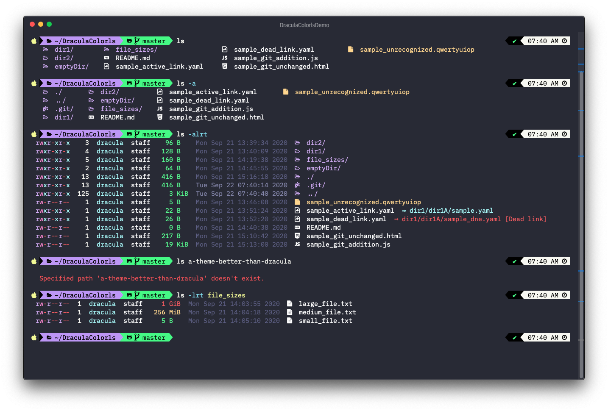

# Dracula for [colorls](https://github.com/athityakumar/colorls)

> A dark theme for [colorls](https://github.com/athityakumar/colorls).

## Install

All instructions can be found at [draculatheme.com/colorls](https://draculatheme.com/colorls).

---

## Samples

Some examples of a select set of  `colorls` options (see the colorls repo for full options):

### Git Status (modified and untracked)

### Git status (untracked)

### File view

### Empty Directory

### Tree view (depth 1)

### File Size

### Verbose

## Team

This theme is maintained by the following person(s) and a bunch of [awesome contributors](https://github.com/dracula/template/graphs/contributors).

|  |
| --- |
| [George Pickering](https://github.com/bigpick) |

## License

[MIT License](./LICENSE)
